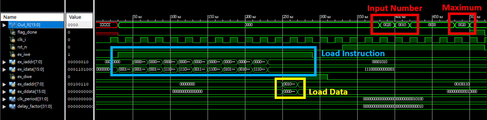
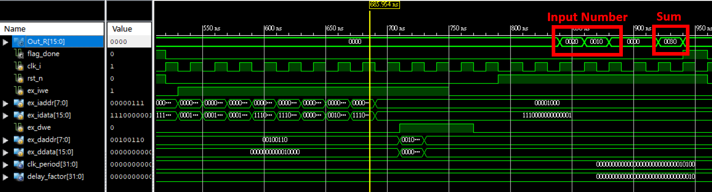
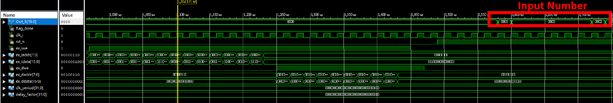
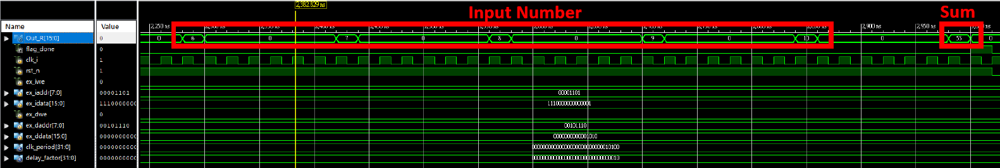
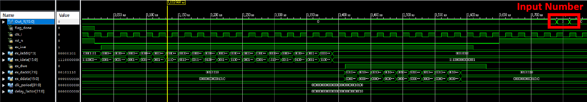
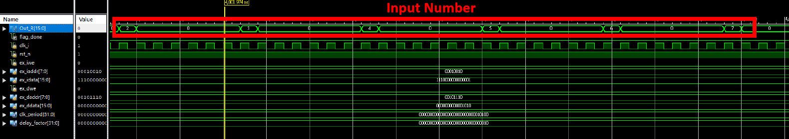
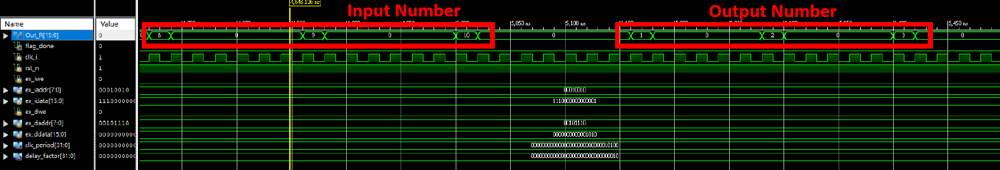
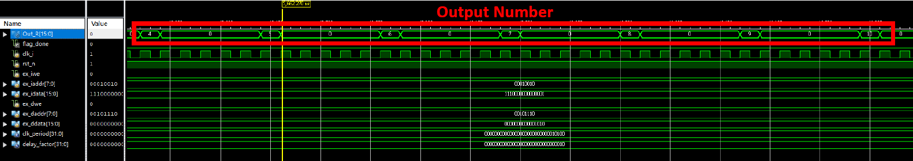

# FPGA Systems Design and Practice (ET5009701)
## Term Project Report
**Due: January 5, 2022**                 
**Instructor: M. B. Lin**

### Behavioral (RTL) Simulations
1. Find the minimum and maximum from two numbers in memory.

    

2. Add two numbers in memory and store the result in another memory location.

    

3. Add ten numbers in consecutive memory locations.

    
    

4. Mov a memory block of N words from one place to another.

    
    
    
    

